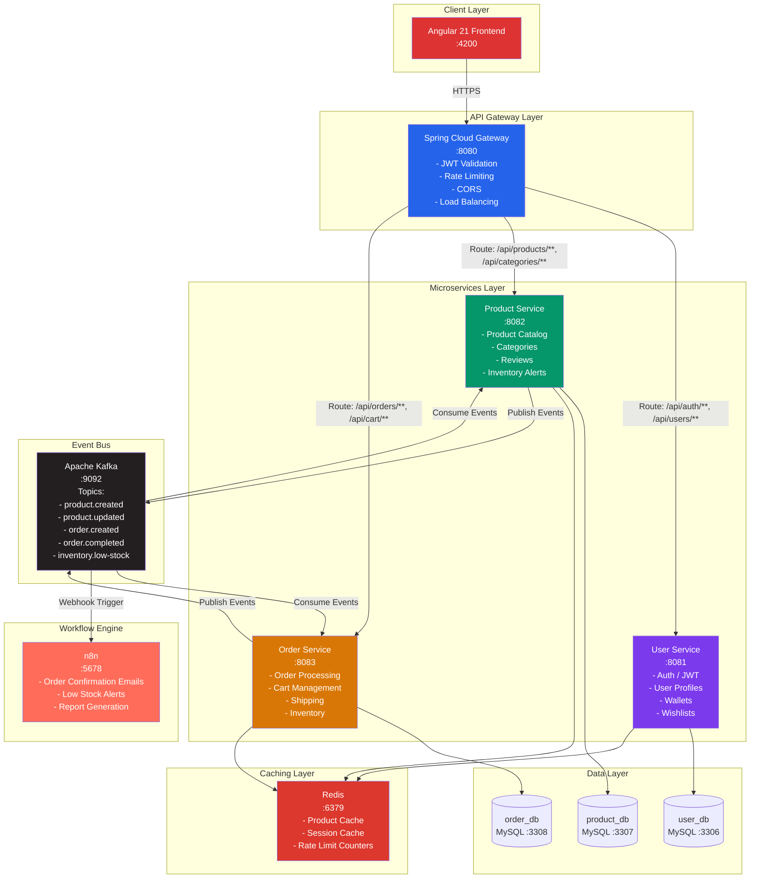
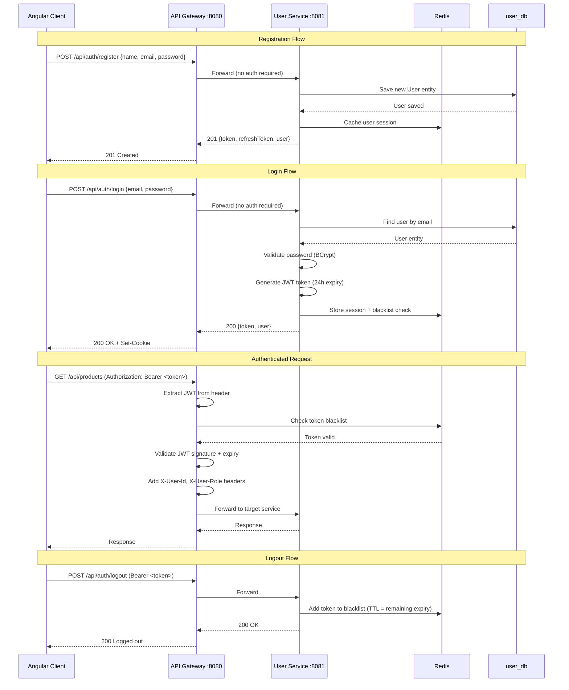
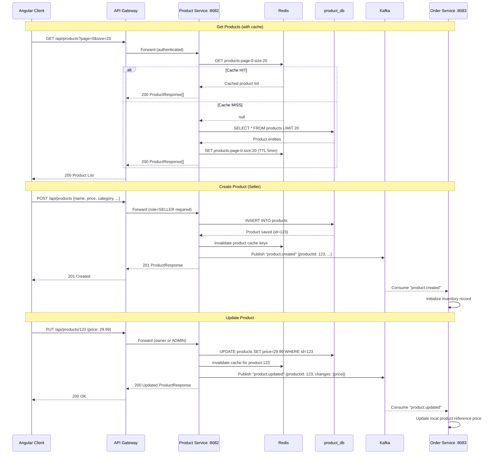
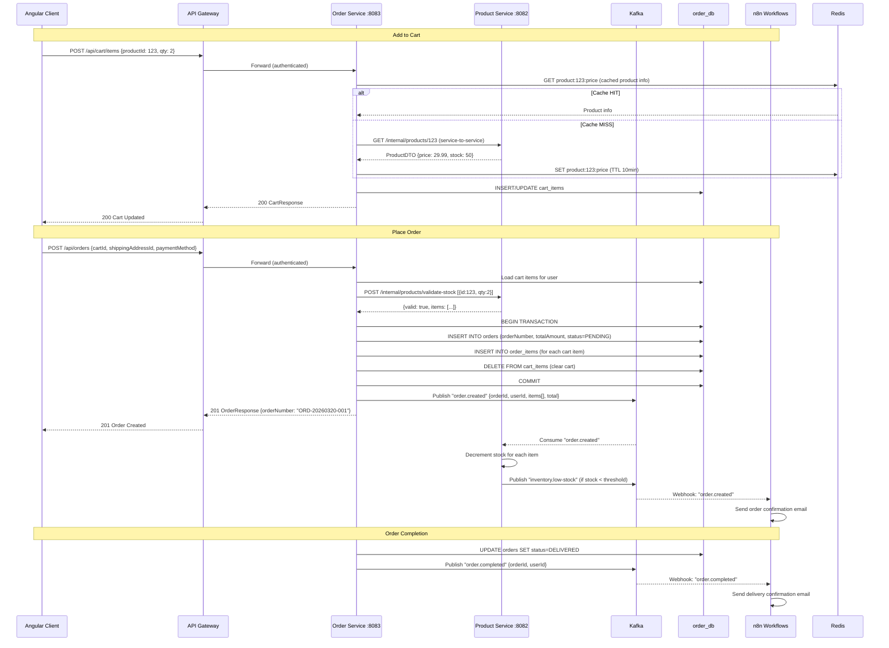
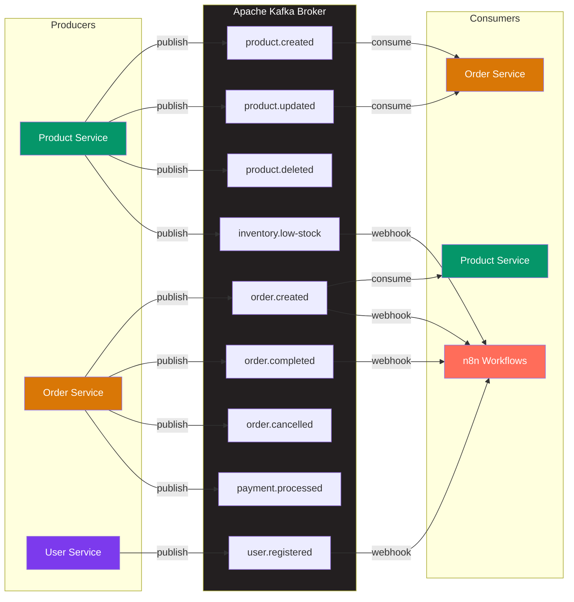
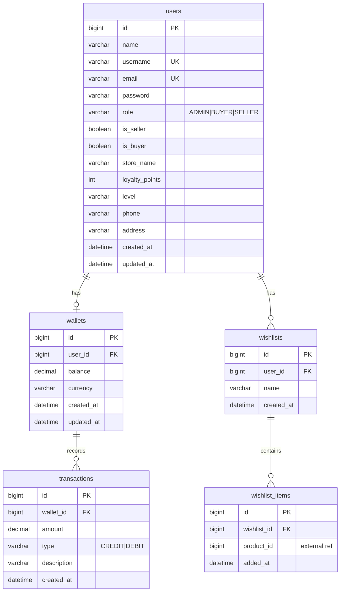
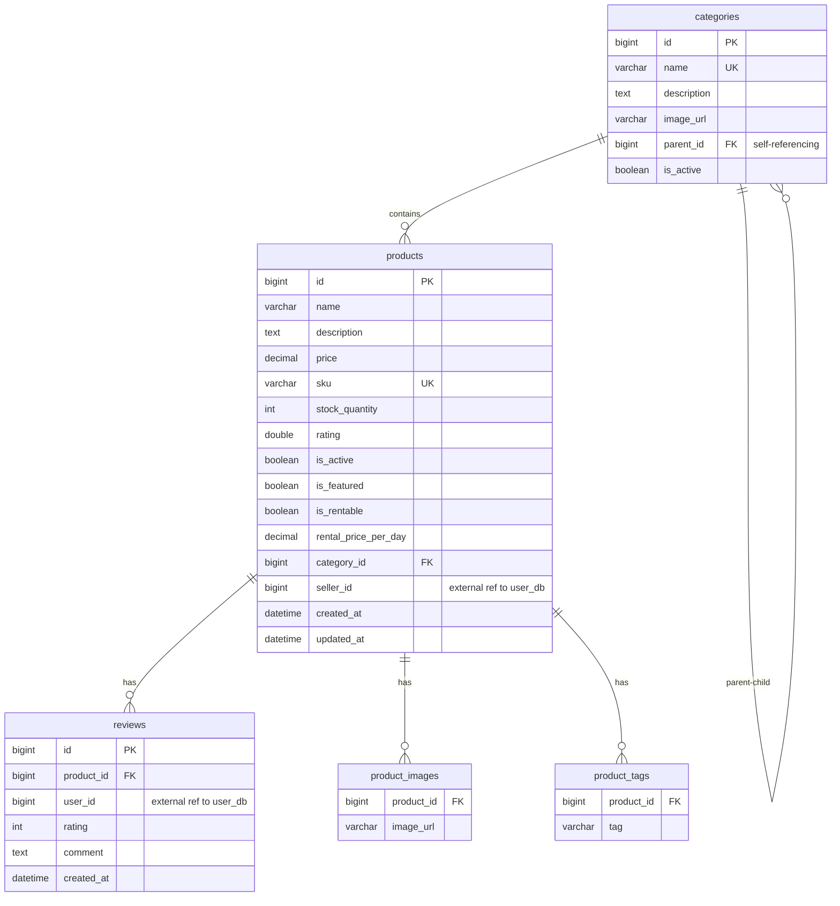
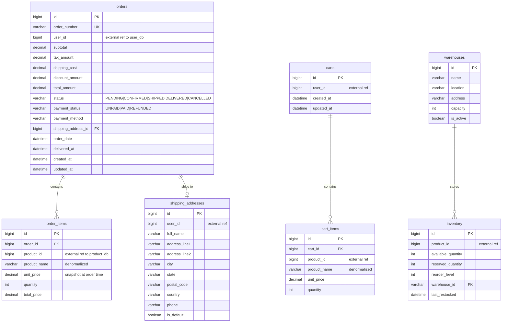

# Architecture Documentation

## Table of Contents
1. [Global Architecture Overview](#1-global-architecture-overview)
2. [Authentication Flow](#2-authentication-flow)
3. [Product Operations Flow](#3-product-operations-flow)
4. [Order Creation Flow](#4-order-creation-flow)
5. [Event-Driven Communication](#5-event-driven-communication)
6. [Database Schemas](#6-database-schemas)
7. [Design Decisions](#7-design-decisions)
8. [Patterns & Best Practices](#8-patterns--best-practices)

---

## 1. Global Architecture Overview

---

## 2. Authentication Flow

---

## 3. Product Operations Flow

---

## 4. Order Creation Flow

---

## 5. Event-Driven Communication

---

## 6. Database Schemas

### 6.1 User Database (user_db)

### 6.2 Product Database (product_db)

### 6.3 Order Database (order_db)

---

## 7. Design Decisions

### 7.1 Why Microservices?

| Concern | Monolith Problem | Microservices Solution |
|---------|-----------------|----------------------|
| **Scalability** | Entire app scales together | Scale Product Service independently during flash sales |
| **Deployment** | Single large deployment | Independent deployments per service |
| **Technology** | Locked to one stack | Each service can evolve independently |
| **Team Ownership** | Shared codebase conflicts | Team per service (Product Team, Order Team) |
| **Fault Isolation** | One bug crashes everything | Product Service failure doesn't affect Order history |
| **Database** | Single shared database = tight coupling | Database per service = loose coupling |

### 7.2 Service Boundaries

We followed **Domain-Driven Design (DDD)** bounded contexts:

- **User Context**: Identity, authentication, profiles, wallets — things that answer "who is this person?"
- **Product Context**: Catalog, categories, reviews — things that answer "what can I buy?"
- **Order Context**: Cart, orders, shipping, inventory — things that answer "what did I buy and where is it?"

### 7.3 Communication Patterns

| Pattern | When | Example |
|---------|------|---------|
| **Synchronous (REST)** | Real-time data needed for request | Order Service validates stock with Product Service |
| **Asynchronous (Kafka)** | Fire-and-forget, eventual consistency | Product created → Order Service initializes inventory |
| **Cache (Redis)** | Frequently read, infrequently changed | Product catalog, user sessions |

### 7.4 Data Consistency Strategy

We use the **Saga Pattern** for distributed transactions:
1. Order Service creates order (PENDING)
2. Publishes `order.created` event
3. Product Service reserves stock
4. If stock unavailable → publishes `order.stock-failed` → Order Service cancels
5. If stock reserved → publishes `stock.reserved` → Order Service confirms

### 7.5 API Gateway Responsibilities

- **Single entry point** for all client requests
- **JWT validation** at the gateway level (services trust internal requests)
- **Route-based forwarding** to appropriate microservice
- **Rate limiting** to prevent abuse
- **CORS handling** centralized
- **Request/Response transformation** (add user context headers)

---

## 8. Patterns & Best Practices

### 8.1 Implemented Patterns

| Pattern | Implementation |
|---------|---------------|
| **API Gateway** | Spring Cloud Gateway with JWT filter |
| **Database per Service** | Separate MySQL instances (user_db, product_db, order_db) |
| **Event-Driven Architecture** | Kafka for async communication |
| **CQRS (light)** | Redis cache for reads, DB for writes |
| **Saga Pattern** | Choreography-based via Kafka events |
| **Circuit Breaker** | Resilience4j for inter-service calls |
| **Service Registry** | Docker Compose DNS (production: Eureka/Consul) |
| **Externalized Config** | application.yml per service + env variables |
| **Health Checks** | Spring Boot Actuator /health endpoints |

### 8.2 Security Best Practices

1. **JWT validated at Gateway** — services don't re-validate
2. **Internal communication** uses service-to-service tokens or network isolation
3. **Secrets management** via environment variables (production: Vault/K8s secrets)
4. **HTTPS everywhere** in production
5. **Rate limiting** at Gateway level
6. **Input validation** at each service boundary

### 8.3 Observability

- **Logging**: Structured JSON logs with correlation IDs
- **Metrics**: Micrometer + Prometheus (future)
- **Tracing**: Spring Cloud Sleuth / Micrometer Tracing (future)
- **Health**: `/actuator/health` on each service

### 8.4 Deployment Best Practices

1. **Docker Compose** for local development
2. **Kubernetes** for production (future)
3. **Blue-Green deployments** for zero-downtime
4. **Database migrations** with Flyway (recommended)
5. **Feature flags** for gradual rollout
